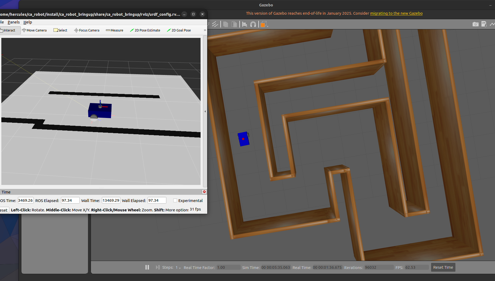

## ROS2 με CA (Κυψελωτα Αυτόματα) για Πλοηγηση Ρομποτ 

Γινεται χρηση  κυψελωτων αυτοματων ```(cellular automata)``` για επεξεργασια του τοπικόυ χάρτη εμποδίων που δημιουργείται από τα δεδομένα του LIDAR.

Με βάση τον ενημερωμένο χάρτη,το ρομποτ παίρνει αποφάσεις πλοήγησης: αν υπάρχει εμπόδιο μπροστά, αλλάζει πορεία ή ενεργοποιεί ένα "escape mode" για να ξεφύγει αν κολλήσει.


 <div style="text-align:center;">
    
</div>

Δημιουργια ενος καινουργιου φακελου ``ca_robot.py `` οπου μεσα βαζω τον φακελο ```src```

στο τρεμτικο μεσα στον ```ca_robot``` γραφω :

```shell
colcon build
colcon build --symlink-install
```
μετα   
```shell 
source install/setup.bash
```

και τελος 
```shell
ros2 launch ca_robot_bringup ca_gazebo.launch.xml  
```
και σε αλλο τερματικο 

```shell
ros2 run ca_robot_controller ca
```

